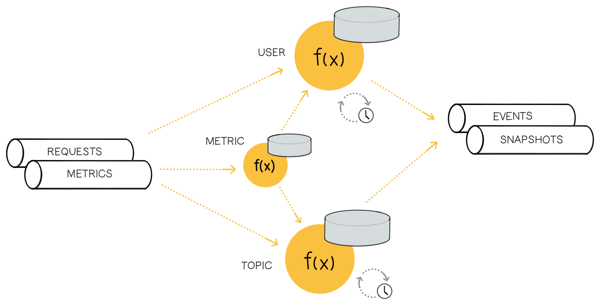

statefun-ops
------------

Use 🌰 [Flink Stateful Functions](https://statefun.io) as a control-plane technology for operating a streaming-platform based on [Apache Kafka](kafka.apache.org).

## Walkthrough

- Run `docker-compose up --detach` to start the infrastructure
- Run `gradle run` to start the _embedded_ Stateful Functions application

Open a new terminal in the same directory.

- Ensure Protobuf and [kafka-python](https://github.com/dpkp/kafka-python) is installed: `pip3 install -r requirements.txt`
- To add a topic, run `python3 ./harness.py add-topic hello-stream`
- To add a user, run `python3 ./harness.py add-user wandering-squirrel`
- To add a credential, run `python3 ./harness.py add-credential wandering-squirrel 5m`

Your new credential will expire in 5 minutes. However, a user can have multiple credentials.

Using your new credential, list topics, produce, and consume from Kafka:
- To list topics, run `kafkacat -b localhost:9092 -X security.protocol=SASL_PLAINTEXT -X sasl.mechanism=SCRAM-SHA-256 -X sasl.username=<credential identifier> -X sasl.password=statefun -L`
- To produce to a topic, run `echo "hello" | kafkacat -b localhost:9092 -X security.protocol=SASL_PLAINTEXT -X sasl.mechanism=SCRAM-SHA-256 -X sasl.username=<credential identifier> -X sasl.password=statefun -P -t hello-stream`
- To consume from a topic, run `kafkacat -b localhost:9092 -X security.protocol=SASL_PLAINTEXT -X sasl.mechanism=SCRAM-SHA-256 -X sasl.username=<credential identifier> -X sasl.password=statefun -C -t hello-stream -o beginning -e`

To cleanup, remove your credentials, users, and topics.
- To revoke a credential, run `python3 ./harness.py revoke-credential <credential identifier>`
- To remove a user, run `python3 ./harness.py remove-user wandering-squirrel`
- To remove a topic, run `python3 ./harness.py remove-topic hello-stream`
- Finally, stop the infrastructure: `docker-compose down`
